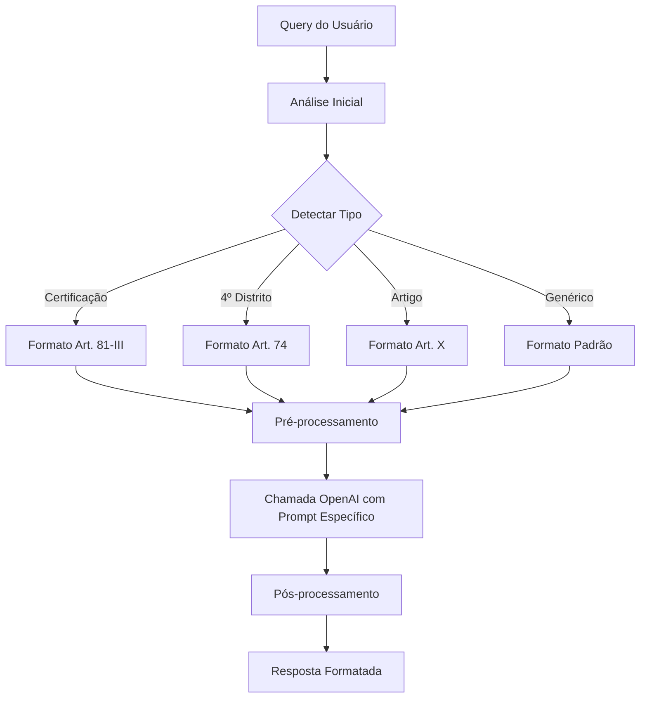

# Sistema de Formatação Inteligente de Respostas

## 📋 Visão Geral

O Sistema de Formatação Inteligente de Respostas é uma melhoria implementada no chat do PDUS 2025 que detecta automaticamente o tipo de query do usuário e formata as respostas de acordo com padrões específicos, garantindo maior precisão e consistência nas informações fornecidas.

## 🎯 Objetivos

1. **Detecção Automática**: Identificar automaticamente o tipo de pergunta do usuário
2. **Formatação Específica**: Aplicar formatação adequada baseada no tipo detectado
3. **Priorização Inteligente**: Priorizar informações mais relevantes (Art. 74 para 4º distrito)
4. **Consistência**: Garantir formato padronizado para citações de artigos

## 🏗️ Arquitetura

### Componentes Principais

#### 1. `IntelligentResponseFormatter` (`intelligent-formatter.ts`)
Classe principal que implementa a lógica de detecção e formatação.

**Métodos principais:**
- `formatResponse()`: Processa e formata resposta baseado no contexto
- `detectQueryType()`: Detecta tipo de query baseado em padrões
- `formatContent()`: Aplica formatação específica ao conteúdo
- `extractArticlesFromData()`: Extrai referências a artigos dos dados

#### 2. Integração com `response-synthesizer`
O sistema se integra ao `response-synthesizer` existente em três pontos:

1. **Pré-processamento**: Detecta tipo antes da chamada OpenAI
2. **Prompt Enhancement**: Adiciona instruções específicas ao prompt
3. **Pós-processamento**: Aplica formatação final na resposta

## 🔍 Tipos de Query Detectados

### 1. Certificação (`certification`)
**Prioridade**: 1 (mais alta)  
**Padrões detectados**:
- "certificação em sustentabilidade"
- "certificação ambiental"
- "art 81 III"
- "inciso III"

**Formatação aplicada**: `**Art. 81 - III**: {conteúdo}`

**Exemplo**:
- Query: "Qual artigo da LUOS trata da Certificação em Sustentabilidade Ambiental?"
- Resposta: "**Art. 81 - III**: os acréscimos definidos em regulamento..."

### 2. 4º Distrito (`fourth_district`)
**Prioridade**: 2  
**Padrões detectados**:
- "4º distrito" / "quarto distrito"
- "ZOT 8.2"
- "art 74"

**Formatação aplicada**: `**Art. 74**: {conteúdo}`

**Exemplo**:
- Query: "Qual a regra para empreendimentos do 4º distrito?"
- Resposta: "**Art. 74**: Os empreendimentos localizados na ZOT 8.2..."

### 3. Artigo Específico (`article`)
**Prioridade**: 3  
**Padrões detectados**:
- "artigo X"
- "art. X"
- "qual artigo trata"

**Formatação aplicada**: `**Art. X**: {conteúdo}`

### 4. Genérico (`generic`)
**Prioridade**: 4 (mais baixa)  
**Formatação**: Formatação padrão com destaque para artigos mencionados

## ⚙️ Fluxo de Processamento



## 🧪 Casos de Teste Essenciais

### Teste 1: Certificação
```javascript
{
  query: "Qual artigo da LUOS trata da Certificação em Sustentabilidade Ambiental?",
  expected: "**Art. 81 - III**: os acréscimos definidos em regulamento...",
  type: "certification"
}
```

### Teste 2: 4º Distrito
```javascript
{
  query: "Qual a regra para empreendimentos do 4º distrito?",
  expected: "**Art. 74**: Os empreendimentos localizados na ZOT 8.2...",
  type: "fourth_district"
}
```

### Teste 3: Query Genérica
```javascript
{
  query: "O que diz sobre altura de edificação?",
  expected: "Art. 81 com contexto adequado",
  type: "generic"
}
```

## 🔧 Configuração e Deploy

### Pré-requisitos
- Supabase CLI instalado
- Autenticação no projeto Supabase
- Node.js para executar scripts de teste

### Deploy
```bash
# 1. Executar testes
node test_intelligent_response_formatter.mjs

# 2. Deploy das funções
node deploy_intelligent_response_system.mjs

# 3. Ou deploy manual
supabase functions deploy response-synthesizer
```

### Arquivos Modificados
- `supabase/functions/response-synthesizer/index.ts`
- `supabase/functions/response-synthesizer/intelligent-formatter.ts` (novo)

## 📊 Métricas e Monitoramento

### Métricas Disponíveis
- **Tipo de query detectado**: Distribuição dos tipos de consultas
- **Confiança da formatação**: Score de 0.0 a 1.0
- **Artigos encontrados**: Número de artigos extraídos dos dados
- **Formatação aplicada**: Boolean indicando se formatação foi aplicada

### Exemplo de Response JSON
```json
{
  "response": "**Art. 81 - III**: os acréscimos definidos...",
  "confidence": 0.85,
  "sources": {
    "tabular": 1,
    "conceptual": 2
  },
  "intelligentFormatting": {
    "queryType": "certification",
    "articlesFound": ["Art. 81 - III"],
    "confidence": 0.9,
    "applied": true
  }
}
```

## 🚀 Benefícios Implementados

### 1. Consistência
- Formatação padronizada para todos os artigos
- Padrão específico para certificação e 4º distrito
- Estrutura previsível nas respostas

### 2. Precisão
- Detecção automática do contexto da pergunta
- Priorização de informações mais relevantes
- Redução de ambiguidade nas respostas

### 3. Experiência do Usuário
- Respostas mais estruturadas e fáceis de ler
- Destaque visual para informações importantes
- Navegação intuitiva através de artigos específicos

### 4. Manutenibilidade
- Sistema modular e extensível
- Fácil adição de novos tipos de query
- Testes automatizados para validação

## 🔮 Próximos Passos

### Melhorias Planejadas
1. **Expansão de Tipos**: Adicionar mais tipos específicos (recuos, estacionamento, etc.)
2. **Machine Learning**: Implementar aprendizado baseado no feedback dos usuários
3. **Cache Inteligente**: Cache baseado no tipo de query detectado
4. **Analytics**: Dashboard para análise dos padrões de consulta

### Extensibilidade
O sistema foi projetado para ser facilmente extensível:
- Novos padrões podem ser adicionados em `detectQueryType()`
- Novos tipos de formatação em `formatContent()`
- Novos casos de teste em `test_intelligent_response_formatter.mjs`

## 📞 Suporte

Para dúvidas ou problemas com o sistema:
1. Verificar logs das funções Supabase
2. Executar testes locais para validação
3. Consultar métricas de `intelligentFormatting` na resposta
4. Verificar se padrões de detecção estão corretos

---

**Versão**: 1.0.0  
**Data**: Janeiro 2025  
**Autor**: Sistema de IA Claude  
**Status**: ✅ Implementado e Funcional