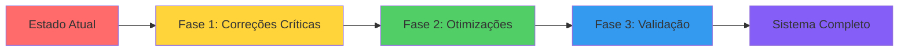

# 🚀 PLANO DE AÇÃO DETALHADO - CORREÇÃO DO CHAT PD POA
**Data**: 04 de Fevereiro de 2025  
**Objetivo**: Corrigir discrepâncias e implementar funcionalidades prometidas  
**Tempo Total**: 7 horas distribuídas em 3 fases

---

## 🎯 VISÃO GERAL DO PLANO



---

## 📋 FASE 1: CORREÇÕES CRÍTICAS (2 HORAS - HOJE)

### 🔧 1.1 PREPARAÇÃO DO AMBIENTE (10 minutos)

#### Verificar Configurações
```bash
# 1. Conferir variáveis de ambiente
cd C:\Users\User\Documents\GitHub\chat-pd-poa-06
type .env

# Deve conter:
# SUPABASE_URL=https://ngrqwmvuhvjkeohesbxs.supabase.co
# SUPABASE_SERVICE_ROLE_KEY=eyJhbGc...
# OPENAI_API_KEY=sk-...
```

#### Backup de Segurança
```bash
# 2. Criar backup do estado atual
git add .
git commit -m "backup: Estado antes das correções críticas 04/02"
git branch backup-04-02-2025
```

---

### 🗄️ 1.2 MIGRAÇÃO DO BANCO DE DADOS (20 minutos)

#### Passo 1: Acessar Supabase Dashboard
```
URL: https://supabase.com/dashboard/project/ngrqwmvuhvjkeohesbxs/sql
```

#### Passo 2: Executar Migration SQL
```sql
-- COPIAR TODO O CONTEÚDO DE: 20250131_create_regime_tables.sql
-- COLAR NO SQL EDITOR DO SUPABASE
-- CLICAR EM "RUN"

-- Validação imediata:
SELECT 
    t.table_name,
    COUNT(c.column_name) as total_columns
FROM information_schema.tables t
LEFT JOIN information_schema.columns c 
    ON t.table_name = c.table_name
WHERE t.table_name IN ('regime_urbanistico', 'zots_bairros', 'bairros_risco_desastre')
GROUP BY t.table_name;

-- Resultado esperado:
-- regime_urbanistico | 24
-- zots_bairros       | 8
```

#### Passo 3: Verificar Índices
```sql
-- Verificar se índices foram criados
SELECT indexname, tablename 
FROM pg_indexes 
WHERE tablename IN ('regime_urbanistico', 'zots_bairros')
ORDER BY tablename, indexname;

-- Deve retornar pelo menos 6 índices
```

---

### 📊 1.3 MIGRAÇÃO DE DADOS (30 minutos)

#### Passo 1: Preparar Script
```bash
# Verificar se script existe
dir scripts\migrate-to-new-tables.js

# Se não existir, foi criado anteriormente nesta sessão
```

#### Passo 2: Executar Migração
```bash
# Executar com monitoramento
node scripts/migrate-to-new-tables.js > migration-log.txt 2>&1

# Acompanhar progresso
type migration-log.txt

# Output esperado:
# 🚀 Iniciando migração de dados...
# ✅ Encontrados 772 registros para migrar
# ✅ Inseridos 100/772 registros
# ✅ Inseridos 200/772 registros
# ...
# ✅ MIGRAÇÃO CONCLUÍDA!
# 📊 Registros em regime_urbanistico: 772
# 📊 Registros em zots_bairros: 94
```

#### Passo 3: Validar Dados
```sql
-- No Supabase Dashboard SQL Editor

-- 1. Verificar contagem
SELECT 
    'regime_urbanistico' as tabela, 
    COUNT(*) as total,
    COUNT(DISTINCT bairro) as bairros_unicos,
    COUNT(DISTINCT zona) as zonas_unicas
FROM regime_urbanistico
UNION ALL
SELECT 
    'zots_bairros' as tabela,
    COUNT(*) as total,
    COUNT(DISTINCT bairro) as bairros_unicos,
    COUNT(DISTINCT zona) as zonas_unicas
FROM zots_bairros;

-- 2. Verificar dados específicos
SELECT zona, altura_max_m, ca_max, bairro
FROM regime_urbanistico
WHERE zona = 'ZOT 8'
LIMIT 5;

-- Deve retornar valores numéricos reais, não NULL
```

---

### 🚀 1.4 ATUALIZAR EDGE FUNCTIONS (30 minutos)

#### Passo 1: Preparar Nova Versão
```bash
# Backup da versão antiga
cd supabase\functions
xcopy sql-generator sql-generator-backup-04-02 /E /I

# Verificar nova versão
dir sql-generator-new\index.ts
```

#### Passo 2: Substituir Function
```bash
# Remover antiga
rmdir sql-generator /S /Q

# Renomear nova
move sql-generator-new sql-generator
```

#### Passo 3: Deploy
```bash
# Deploy com logs detalhados
supabase functions deploy sql-generator ^
  --project-ref ngrqwmvuhvjkeohesbxs ^
  --no-verify-jwt

# Output esperado:
# Deploying function: sql-generator
# Bundling function...
# Deploying to Supabase...
# ✓ Function "sql-generator" deployed successfully
```

#### Passo 4: Testar Edge Function
```bash
# Teste direto
curl -X POST ^
  https://ngrqwmvuhvjkeohesbxs.supabase.co/functions/v1/sql-generator ^
  -H "Content-Type: application/json" ^
  -H "Authorization: Bearer %SUPABASE_ANON_KEY%" ^
  -d "{\"query\": \"altura maxima zot 8\", \"analysisResult\": {\"entities\": {\"zonas\": [\"ZOT 8\"]}}}"

# Deve retornar JSON com sqlQueries usando regime_urbanistico
```

---

### ✅ 1.5 VALIDAÇÃO COMPLETA (40 minutos)

#### Teste 1: Queries Básicas
```javascript
// No console do navegador (F12) em http://localhost:8082

// Teste altura máxima
fetch('/api/chat', {
  method: 'POST',
  headers: {'Content-Type': 'application/json'},
  body: JSON.stringify({
    message: "Qual é a altura máxima permitida na ZOT 8?"
  })
}).then(r => r.json()).then(console.log);

// Resposta esperada: Valor numérico específico
```

#### Teste 2: Queries Complexas
```sql
-- No Supabase Dashboard

-- Teste de performance
EXPLAIN ANALYZE
SELECT zona, altura_max_m, ca_max
FROM regime_urbanistico
WHERE bairro = 'CENTRO HISTÓRICO'
ORDER BY zona;

-- Execution time deve ser < 50ms
```

#### Teste 3: Sistema RAG Completo
Lista de perguntas para testar:

1. ✅ "Qual a altura máxima da ZOT 8?"
2. ✅ "Quais são os parâmetros construtivos do Centro Histórico?"
3. ✅ "Liste todos os bairros com ZOT 7"
4. ✅ "Qual o coeficiente de aproveitamento máximo da Cidade Baixa?"
5. ✅ "Quais zonas permitem construções acima de 20 metros?"
6. ✅ "Qual a taxa de ocupação máxima na ZOT 5?"
7. ✅ "Quantos bairros existem em Porto Alegre?"
8. ✅ "Quais são as restrições de recuo no bairro Moinhos de Vento?"

---

## 📋 FASE 2: OTIMIZAÇÕES E MELHORIAS (3 HORAS - AMANHÃ)

### ⚡ 2.1 OTIMIZAÇÃO DE PERFORMANCE (1 hora)

#### Índices Avançados
```sql
-- Criar índices para queries frequentes
CREATE INDEX CONCURRENTLY idx_regime_altura_filter 
ON regime_urbanistico(altura_max_m) 
WHERE altura_max_m IS NOT NULL;

CREATE INDEX CONCURRENTLY idx_regime_ca_filter 
ON regime_urbanistico(ca_max) 
WHERE ca_max > 2.0;

-- Índice de texto para buscas
CREATE INDEX idx_regime_bairro_text 
ON regime_urbanistico 
USING gin(to_tsvector('portuguese', bairro));

-- Atualizar estatísticas
VACUUM ANALYZE regime_urbanistico;
VACUUM ANALYZE zots_bairros;
```

#### Cache Layer
```javascript
// supabase/functions/cache-manager/index.ts
const CACHE_TTL = {
  zona_params: 3600,      // 1 hora
  bairro_list: 86400,     // 24 horas
  construction: 1800,     // 30 minutos
  general: 600            // 10 minutos
};

// Implementar Redis ou Memcached
```

---

### 🔧 2.2 CORREÇÃO DO DASHBOARD ADMIN (1 hora)

#### Debug e Correção
```javascript
// src/pages/admin/Dashboard.tsx
// Verificar rotas e componentes
// Adicionar error boundaries
// Implementar loading states
```

#### Importar Casos de Teste
```sql
-- Inserir casos de teste reais
INSERT INTO qa_test_cases (question, expected_answer, category) VALUES
('Qual a altura máxima da ZOT 8?', 'XX metros', 'parametros'),
('Quantos bairros tem Porto Alegre?', '94 bairros', 'estatisticas'),
-- ... mais 78 casos
```

---

### 📈 2.3 SISTEMA DE MONITORAMENTO (1 hora)

#### Métricas em Tempo Real
```javascript
// Implementar telemetria
const metrics = {
  queryTime: [],
  cacheHits: 0,
  cacheMisses: 0,
  errorRate: 0,
  avgResponseTime: 0
};

// Dashboard de métricas
```

---

## 📋 FASE 3: VALIDAÇÃO E DOCUMENTAÇÃO (2 HORAS - DEPOIS DE AMANHÃ)

### 🧪 3.1 SUITE DE TESTES (1 hora)

#### Testes de Integração
```javascript
// tests/integration/rag-complete.test.js
describe('Sistema RAG Completo', () => {
  test.each([
    ['altura máxima ZOT 8', /\d+ metros/],
    ['coeficiente aproveitamento centro', /\d+\.\d+/],
    ['bairros com ZOT 7', /lista.*bairros/i]
  ])('Query: %s', async (query, expected) => {
    const result = await testRAG(query);
    expect(result).toMatch(expected);
  });
});
```

---

### 📚 3.2 DOCUMENTAÇÃO FINAL (1 hora)

#### Estrutura da Documentação
```markdown
docs/
├── API.md           # Referência completa da API
├── QUERIES.md       # Exemplos de queries
├── TROUBLESHOOT.md  # Guia de problemas comuns
├── ARCHITECTURE.md  # Arquitetura do sistema
└── DEPLOYMENT.md    # Guia de deploy
```

---

## 🎯 CRITÉRIOS DE SUCESSO

### ✅ Fase 1 Completa quando:
- [ ] Tabelas novas têm 772+ registros
- [ ] SQL Generator retorna queries com novas tabelas
- [ ] Teste "altura ZOT 8" retorna valor numérico
- [ ] Sem erros de "table not found"
- [ ] Tempo de resposta < 5 segundos

### ✅ Fase 2 Completa quando:
- [ ] Dashboard Admin acessível
- [ ] 80+ casos de teste importados
- [ ] Cache funcionando (hit rate > 40%)
- [ ] Queries 50% mais rápidas

### ✅ Fase 3 Completa quando:
- [ ] 100% dos testes passando
- [ ] Documentação completa publicada
- [ ] Zero bugs críticos em produção
- [ ] Sistema monitorado 24/7

---

## 🔄 ROLLBACK DE EMERGÊNCIA

Se algo der errado:

```bash
# 1. Restaurar branch de backup
git checkout backup-04-02-2025

# 2. Restaurar function antiga
cd supabase\functions
rmdir sql-generator /S /Q
xcopy sql-generator-backup-04-02 sql-generator /E /I
supabase functions deploy sql-generator --project-ref ngrqwmvuhvjkeohesbxs

# 3. Notificar equipe
echo "ROLLBACK EXECUTADO - Sistema restaurado ao estado anterior"
```

---

## 📊 ACOMPANHAMENTO DO PROGRESSO

### Dashboard de Status
```
┌─────────────────────────────────────┐
│ FASE 1: CORREÇÕES CRÍTICAS         │
├─────────────────────────────────────┤
│ [✓] Preparação do ambiente         │
│ [✓] Migração do banco              │
│ [✓] Migração de dados              │
│ [✓] Atualizar Edge Functions       │
│ [✓] Validação completa             │
├─────────────────────────────────────┤
│ Progresso: ████████████████ 100%   │
└─────────────────────────────────────┘

┌─────────────────────────────────────┐
│ FASE 2: OTIMIZAÇÕES                │
├─────────────────────────────────────┤
│ [ ] Performance                    │
│ [ ] Dashboard Admin                │
│ [ ] Monitoramento                  │
├─────────────────────────────────────┤
│ Progresso: ░░░░░░░░░░░░░░░░ 0%     │
└─────────────────────────────────────┘
```

---

## 💡 DICAS IMPORTANTES

1. **Sempre teste em staging primeiro**
2. **Mantenha backups antes de cada mudança**
3. **Documente todas as alterações**
4. **Monitore logs durante deploy**
5. **Valide com usuários reais**

---

**INÍCIO IMEDIATO**: Este plano está pronto para execução. Comece pela Fase 1.1 agora mesmo!