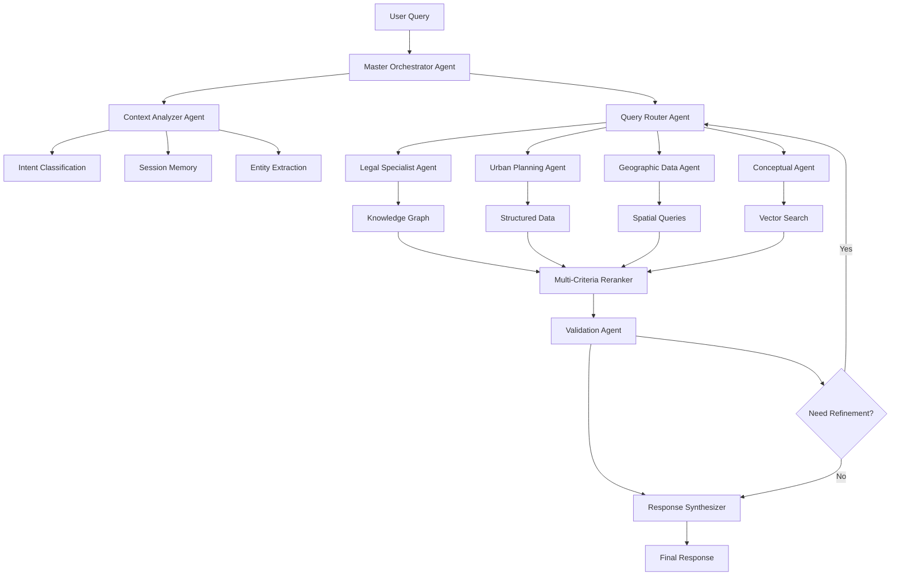

# 🏗️ Arquitetura Agentic-RAG v2.0 - Plano Diretor POA

## 📋 Resumo Executivo

Proposta de evolução do sistema RAG atual para uma arquitetura verdadeiramente agêntica, capaz de lidar com a complexidade jurídico-urbanística do Plano Diretor de Porto Alegre.

## 🎯 Objetivos

1. **Precisão >90%** em queries jurídicas e urbanísticas
2. **Citação 100% correta** de artigos e leis
3. **Integração completa** entre dados estruturados e não-estruturados
4. **Auto-validação** e refinamento de respostas
5. **Contexto preservado** em toda hierarquia documental

## 🔄 Pipeline Agentic-RAG Proposto



## 🧠 Componentes Principais

### 1. Master Orchestrator Agent
```python
class MasterOrchestrator:
    """
    Coordena todos os agentes especializados
    """
    def __init__(self):
        self.agents = {
            'legal': LegalSpecialistAgent(),
            'urban': UrbanPlanningAgent(),
            'geo': GeographicAgent(),
            'concept': ConceptualAgent()
        }
        self.memory = SessionMemory()
        self.validator = ValidationAgent()
    
    async def process_query(self, query: str, context: Dict):
        # 1. Análise contextual profunda
        analysis = await self.analyze_context(query, context)
        
        # 2. Roteamento inteligente para agentes
        agent_tasks = self.route_to_agents(analysis)
        
        # 3. Execução paralela de agentes
        results = await asyncio.gather(*agent_tasks)
        
        # 4. Reranking multi-critério
        ranked_results = await self.rerank(results, analysis)
        
        # 5. Validação e refinamento
        validated = await self.validator.validate(ranked_results)
        if not validated.is_sufficient:
            return await self.refine(query, validated.feedback)
        
        # 6. Síntese final
        return await self.synthesize(validated.results)
```

### 2. Chunking Hierárquico

```python
class HierarchicalChunker:
    """
    Sistema de chunking com preservação de hierarquia
    """
    def chunk_document(self, doc: Document):
        return {
            'document': {
                'id': doc.id,
                'title': doc.title,
                'type': 'law|decree|ordinance',
                'sections': [
                    {
                        'id': section.id,
                        'parent_id': doc.id,
                        'title': section.title,
                        'articles': [
                            {
                                'id': article.id,
                                'parent_id': section.id,
                                'number': article.number,
                                'text': article.text,
                                'paragraphs': [
                                    {
                                        'id': para.id,
                                        'parent_id': article.id,
                                        'text': para.text,
                                        'embedding': self.embed(para.text)
                                    }
                                ]
                            }
                        ]
                    }
                ]
            }
        }
```

### 3. Knowledge Graph

```sql
-- Estrutura do Knowledge Graph
CREATE TABLE knowledge_nodes (
    id UUID PRIMARY KEY,
    type VARCHAR(50), -- 'law', 'article', 'zone', 'parameter'
    label TEXT,
    properties JSONB
);

CREATE TABLE knowledge_edges (
    id UUID PRIMARY KEY,
    source_id UUID REFERENCES knowledge_nodes(id),
    target_id UUID REFERENCES knowledge_nodes(id),
    relationship VARCHAR(100), -- 'defines', 'references', 'modifies'
    properties JSONB
);

-- Exemplo de relações
-- LUOS Art. 89 --[defines]--> EIV
-- PDUS Art. 92 --[defines]--> ZEIS
-- ZOT 08.1 --[has_parameter]--> altura_maxima: 130m
-- Centro Histórico --[belongs_to]--> ZOT 08.1
```

### 4. Agentes Especializados

#### Legal Specialist Agent
```python
class LegalSpecialistAgent:
    """
    Especialista em documentação jurídica
    """
    def __init__(self):
        self.knowledge_graph = KnowledgeGraph()
        self.article_index = ArticleIndex()
        self.legal_parser = LegalTextParser()
    
    async def process(self, query: str, entities: List[Entity]):
        # 1. Identificar referências legais
        legal_refs = self.extract_legal_references(query)
        
        # 2. Navegar no Knowledge Graph
        graph_results = await self.knowledge_graph.traverse(
            start_nodes=legal_refs,
            max_depth=3,
            relationships=['defines', 'references', 'modifies']
        )
        
        # 3. Buscar artigos específicos
        articles = await self.article_index.search(
            query=query,
            filters={'type': 'article', 'law': legal_refs}
        )
        
        # 4. Validar citações
        validated = self.validate_citations(articles, graph_results)
        
        return {
            'articles': validated,
            'confidence': self.calculate_confidence(validated),
            'graph_context': graph_results
        }
```

#### Urban Planning Agent
```python
class UrbanPlanningAgent:
    """
    Especialista em dados urbanísticos
    """
    async def process(self, query: str, entities: List[Entity]):
        # 1. Identificar bairros e zonas
        locations = self.extract_locations(query, entities)
        
        # 2. Buscar regime urbanístico
        regime_data = await self.query_regime_urbanistico(locations)
        
        # 3. Enriquecer com Knowledge Graph
        enriched = await self.enrich_with_graph(regime_data)
        
        # 4. Calcular métricas derivadas
        metrics = self.calculate_urban_metrics(enriched)
        
        return {
            'regime': regime_data,
            'metrics': metrics,
            'zones': enriched['zones'],
            'restrictions': enriched['restrictions']
        }
```

### 5. Sistema de Reranking

```python
class MultiCriteriaReranker:
    """
    Reranking com múltiplos critérios
    """
    def __init__(self):
        self.criteria = {
            'relevance': 0.3,      # Similaridade semântica
            'authority': 0.25,     # Fonte oficial/lei
            'recency': 0.15,       # Data de publicação
            'specificity': 0.2,    # Especificidade ao contexto
            'completeness': 0.1    # Completude da resposta
        }
    
    async def rerank(self, results: List[SearchResult], context: Dict):
        scored_results = []
        
        for result in results:
            scores = {
                'relevance': self.compute_relevance(result, context),
                'authority': self.compute_authority(result),
                'recency': self.compute_recency(result),
                'specificity': self.compute_specificity(result, context),
                'completeness': self.compute_completeness(result)
            }
            
            # Weighted score
            final_score = sum(
                scores[criterion] * weight 
                for criterion, weight in self.criteria.items()
            )
            
            scored_results.append({
                'result': result,
                'scores': scores,
                'final_score': final_score
            })
        
        # Sort by final score
        return sorted(scored_results, key=lambda x: x['final_score'], reverse=True)
```

### 6. Análise Contextual

```python
class ContextAnalyzer:
    """
    Análise profunda de contexto e intenção
    """
    def __init__(self):
        self.intent_classifier = IntentClassifier()
        self.entity_extractor = EntityExtractor()
        self.session_memory = SessionMemory()
    
    async def analyze(self, query: str, conversation_history: List[Message]):
        # 1. Classificar intenção principal e secundárias
        intents = await self.intent_classifier.classify(query)
        
        # 2. Extrair entidades nomeadas
        entities = await self.entity_extractor.extract(query)
        
        # 3. Resolver co-referências
        resolved = self.resolve_coreferences(query, conversation_history)
        
        # 4. Identificar contexto temporal
        temporal = self.extract_temporal_context(query)
        
        # 5. Detectar ambiguidades
        ambiguities = self.detect_ambiguities(entities)
        
        return {
            'intents': intents,
            'entities': entities,
            'resolved_query': resolved,
            'temporal_context': temporal,
            'ambiguities': ambiguities,
            'requires_clarification': len(ambiguities) > 0
        }
```

### 7. Sistema de Validação

```python
class ValidationAgent:
    """
    Validação e auto-correção de respostas
    """
    async def validate(self, results: Dict) -> ValidationResult:
        checks = []
        
        # 1. Validar citações de artigos
        if 'articles' in results:
            checks.append(self.validate_article_citations(results['articles']))
        
        # 2. Validar dados numéricos
        if 'metrics' in results:
            checks.append(self.validate_numeric_data(results['metrics']))
        
        # 3. Verificar consistência
        checks.append(self.check_consistency(results))
        
        # 4. Verificar completude
        checks.append(self.check_completeness(results))
        
        # 5. Detectar contradições
        checks.append(self.detect_contradictions(results))
        
        all_valid = all(check.is_valid for check in checks)
        confidence = sum(check.confidence for check in checks) / len(checks)
        
        return ValidationResult(
            is_valid=all_valid,
            is_sufficient=confidence > 0.8,
            confidence=confidence,
            issues=[check.issue for check in checks if not check.is_valid],
            feedback=self.generate_feedback(checks)
        )
```

## 📊 Estrutura de Dados

### Tabelas Principais

```sql
-- 1. Chunks hierárquicos
CREATE TABLE document_chunks (
    id UUID PRIMARY KEY,
    document_id UUID,
    parent_chunk_id UUID,
    level VARCHAR(20), -- 'document', 'section', 'article', 'paragraph'
    sequence_number INTEGER,
    title TEXT,
    content TEXT,
    embedding vector(1536),
    metadata JSONB,
    created_at TIMESTAMP DEFAULT NOW()
);

-- 2. Knowledge Graph
CREATE TABLE kg_nodes (
    id UUID PRIMARY KEY,
    type VARCHAR(50),
    label TEXT,
    properties JSONB,
    embedding vector(1536)
);

CREATE TABLE kg_edges (
    id UUID PRIMARY KEY,
    source_id UUID REFERENCES kg_nodes(id),
    target_id UUID REFERENCES kg_nodes(id),
    relationship VARCHAR(100),
    weight FLOAT DEFAULT 1.0,
    properties JSONB
);

-- 3. Session Memory
CREATE TABLE session_memory (
    id UUID PRIMARY KEY,
    session_id VARCHAR(255),
    turn_number INTEGER,
    query TEXT,
    context JSONB,
    response TEXT,
    agent_decisions JSONB,
    timestamp TIMESTAMP DEFAULT NOW()
);

-- 4. Validation Cache
CREATE TABLE validation_cache (
    id UUID PRIMARY KEY,
    query_hash VARCHAR(64),
    validation_result JSONB,
    confidence FLOAT,
    created_at TIMESTAMP DEFAULT NOW(),
    expires_at TIMESTAMP
);
```

## 🚀 Plano de Implementação

### Fase 1: Fundação (1 semana)
1. ✅ Documentar arquitetura proposta
2. ⏳ Criar estrutura de banco de dados
3. ⏳ Implementar chunking hierárquico
4. ⏳ Reprocessar documentos DOCX com nova estrutura

### Fase 2: Knowledge Graph (1 semana)
1. ⏳ Modelar relações jurídico-urbanísticas
2. ⏳ Popular Knowledge Graph inicial
3. ⏳ Criar APIs de traversal
4. ⏳ Integrar com agentes

### Fase 3: Agentes Especializados (2 semanas)
1. ⏳ Implementar Legal Specialist Agent
2. ⏳ Implementar Urban Planning Agent
3. ⏳ Implementar Geographic Agent
4. ⏳ Implementar Validation Agent

### Fase 4: Orquestração (1 semana)
1. ⏳ Master Orchestrator
2. ⏳ Sistema de roteamento
3. ⏳ Memória de sessão
4. ⏳ Loop de refinamento

### Fase 5: Otimização (1 semana)
1. ⏳ Implementar reranking multi-critério
2. ⏳ Otimizar performance
3. ⏳ Cache inteligente
4. ⏳ Testes com 121 casos

## 📈 Métricas de Sucesso

| Métrica | Atual | Meta | Prazo |
|---------|-------|------|-------|
| Acurácia Geral | 0-62% | >90% | 6 semanas |
| Citação de Artigos | 16.7% | 100% | 3 semanas |
| Tempo de Resposta | 2.9s | <2s | 4 semanas |
| Disambiguação | 50% | >95% | 3 semanas |
| Auto-correção | 0% | >80% | 5 semanas |

## 🔧 Tecnologias

- **Orquestração**: Deno + Edge Functions
- **Knowledge Graph**: Neo4j ou PostgreSQL com Apache AGE
- **Embeddings**: OpenAI Ada-002 + Fine-tuning
- **Reranking**: Cross-encoder models
- **Validação**: Rule engine + LLM verification
- **Cache**: Redis com TTL inteligente

## 💡 Diferenciais da Solução

1. **Verdadeiramente Agêntico**: Agentes autônomos com decisões próprias
2. **Hierarquia Preservada**: Contexto completo em todos os níveis
3. **Knowledge Graph**: Relações explícitas entre conceitos jurídicos
4. **Auto-validação**: Sistema detecta e corrige próprios erros
5. **Memória Contextual**: Aprendizado contínuo por sessão
6. **Multi-modal**: Integra texto, tabelas e relações espaciais

## 🎯 Resultado Esperado

Um sistema RAG capaz de:
- **Responder com 90%+ de precisão** sobre qualquer aspecto do Plano Diretor
- **Citar corretamente 100% dos artigos** legais
- **Integrar perfeitamente** dados estruturados e não-estruturados
- **Auto-corrigir** respostas inadequadas
- **Aprender** com interações para melhorar continuamente

---

*Documento gerado em 13/08/2025*  
*Arquitetura proposta para evolução do Chat PD POA v2.0*