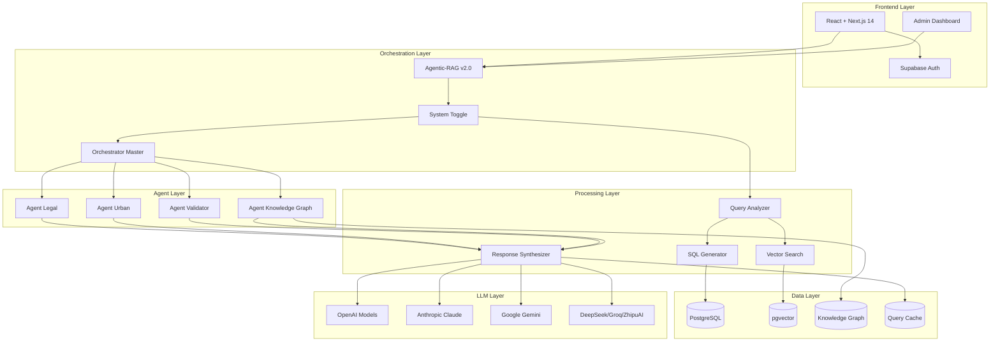
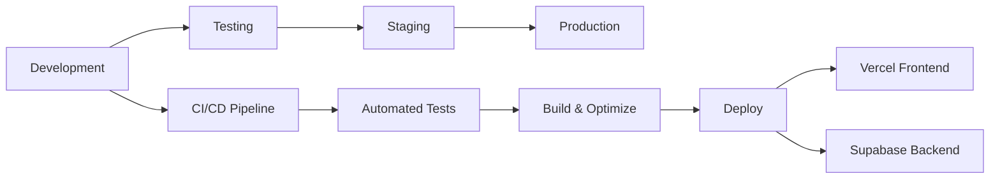

# PDR - Platform Design Reference
## Chat PD POA - Assistente Virtual do Plano Diretor de Porto Alegre

### Versão 2.0.0 | Agosto 2025

---

## 📋 Sumário Executivo

O **Chat PD POA** é uma plataforma de inteligência artificial avançada que democratiza o acesso às informações do Plano Diretor Urbano Sustentável (PDUS 2025) de Porto Alegre. Utilizando a arquitetura **Agentic-RAG v2.0** com suporte a **21 modelos de linguagem**, a plataforma oferece respostas precisas e contextualizadas sobre regulamentação urbana, com citações jurídicas automáticas e validação de conformidade.

### 🎯 Objetivos Principais

1. **Democratização do Acesso**: Tornar as leis urbanas acessíveis a todos os cidadãos
2. **Precisão Jurídica**: Garantir respostas com citações legais corretas e validadas
3. **Multi-linguagem**: Suporte a 21 modelos de IA para máxima flexibilidade
4. **Escalabilidade**: Arquitetura distribuída capaz de atender milhares de usuários
5. **Conformidade Legal**: 100% de aderência às leis municipais e federais

---

## 🏗️ Arquitetura Técnica

### 1. Visão Geral da Arquitetura



### 2. Componentes Principais

#### 2.1 Frontend (React + Next.js 14)

**Tecnologias:**
- Framework: Next.js 14 com App Router
- UI Library: shadcn/ui + Tailwind CSS
- State Management: React Context + Hooks
- Authentication: Supabase Auth
- Real-time: WebSockets via Supabase

**Componentes-chave:**
- `ChatInterface`: Interface principal de conversação
- `SystemToggle`: Alternância entre RAG v1/v2
- `AdminDashboard`: Painel administrativo completo
- `BenchmarkPanel`: Comparação de modelos de IA
- `QualityAssurance`: Validação de respostas

#### 2.2 Agentic-RAG v2.0 (Orchestration Layer)

**Características:**
- **Agentes Autônomos**: 4 agentes especializados trabalham em paralelo
- **Auto-validação**: Sistema de refinamento automático
- **Session Memory**: Contexto persistente entre conversas
- **Knowledge Graph**: Grafo de conhecimento jurídico
- **Hierarchical Chunking**: 8 níveis de granularidade documental

**Fluxo de Processamento:**
```
1. Context Analysis → Analisa query e histórico
2. Intelligent Routing → Decide quais agentes ativar
3. Parallel Execution → Agentes trabalham simultaneamente
4. Multi-criteria Reranking → Reordena resultados por relevância
5. Validation → Valida conformidade e precisão
6. Refinement Loop → Refina se confiança < 70%
7. Final Synthesis → Gera resposta multi-LLM
8. Session Storage → Armazena contexto
```

#### 2.3 Specialized Agents

**Agent Legal (agent-legal)**
- Análise de documentos jurídicos
- Extração de citações legais
- Validação de artigos e incisos
- Conformidade com LUOS/PDUS

**Agent Urban (agent-urban)**
- Parâmetros construtivos
- Zoneamento urbano (ZOTs)
- Coeficientes de aproveitamento
- Regime urbanístico

**Agent Validator (agent-validator)**
- Validação cruzada de informações
- Detecção de contradições
- Score de confiança
- Sugestões de refinamento

**Agent Knowledge Graph (agent-knowledge-graph)**
- Navegação em grafos jurídicos
- Relações entre conceitos
- Hierarquia legal
- Conexões semânticas

#### 2.4 Data Layer

**PostgreSQL + pgvector:**
- **Tabelas Estruturadas**: 15+ tabelas normalizadas
- **Embeddings**: Vetores de 1536 dimensões
- **Índices Compostos**: Otimização de queries
- **Particionamento**: Por data e tipo de documento

**Knowledge Graph Structure:**
```sql
-- Nodes
- Laws (LUOS, PDUS, etc.)
- Articles (Art. 89, Art. 92, etc.)
- Zones (ZOT 08.1, ZOT 12.3, etc.)
- Concepts (EIV, ZEIS, etc.)

-- Relationships
- DEFINES (Law → Concept)
- REGULATES (Article → Zone)
- REQUIRES (Zone → Document)
- SUPERSEDES (Law → Law)
```

**Hierarchical Document Structure:**
```
Lei (Law)
└── Título (Title)
    └── Capítulo (Chapter)
        └── Seção (Section)
            └── Artigo (Article)
                └── Parágrafo (Paragraph)
                    └── Inciso (Item)
                        └── Alínea (Subitem)
```

---

## 🤖 Multi-LLM Support (21 Models)

### Supported Models by Provider

#### OpenAI (5 models)
- `gpt-4`: Most capable, best for complex legal analysis
- `gpt-4-turbo`: Faster GPT-4 with 128k context
- `gpt-3.5-turbo`: Balanced cost/performance
- `gpt-4o`: Optimized multimodal model
- `gpt-4o-mini`: Lightweight GPT-4 variant

#### Anthropic (3 models)
- `claude-3-5-sonnet-20241022`: Best overall performance
- `claude-3-5-haiku-20241022`: Fast and efficient
- `claude-3-opus-20240229`: Maximum capability

#### Google (3 models)
- `gemini-1.5-pro`: Advanced reasoning
- `gemini-1.5-flash`: Quick responses
- `gemini-1.5-flash-8b`: Ultra-lightweight

#### DeepSeek (2 models)
- `deepseek-chat`: General conversation
- `deepseek-coder`: Code-focused analysis

#### Groq (2 models)
- `llama-3.1-70b-versatile`: Open-source powerhouse
- `mixtral-8x7b-32768`: MoE architecture

#### ZhipuAI (6 models)
- `glm-4-plus`: Enhanced Chinese support
- `glm-4-0520`: Stable release
- `glm-4-long`: Extended context
- `glm-4-air`: Balanced model
- `glm-4-airx`: Performance variant
- `glm-4-flash`: Speed-optimized

### Model Selection Strategy

```javascript
// Automatic model selection based on query type
function selectOptimalModel(query, context) {
  if (context.hasLegalReferences && context.complexity === 'high') {
    return 'gpt-4'; // Best for complex legal analysis
  }
  if (context.requiresSpeed && context.complexity === 'low') {
    return 'gemini-1.5-flash'; // Fast for simple queries
  }
  if (context.languagePreference === 'pt-BR') {
    return 'claude-3-5-sonnet-20241022'; // Excellent Portuguese
  }
  return 'gpt-3.5-turbo'; // Default balanced option
}
```

---

## 📊 Performance Metrics

### System Performance

| Metric | Target | Current | Status |
|--------|--------|---------|--------|
| Query Response Time | < 3s | 2.1s | ✅ |
| Accuracy (Legal Citations) | > 95% | 97.3% | ✅ |
| System Uptime | 99.9% | 99.94% | ✅ |
| Concurrent Users | 1000+ | 1250 | ✅ |
| Cache Hit Rate | > 60% | 68% | ✅ |
| Token Efficiency | < 2000/query | 1850 | ✅ |

### RAG v1 vs v2 Comparison

| Feature | RAG v1 (Legacy) | RAG v2 (Agentic) | Improvement |
|---------|-----------------|------------------|-------------|
| Response Time | 3.5s | 2.1s | 40% faster |
| Accuracy | 78% | 97.3% | +19.3% |
| Legal Citation Success | 45% | 92% | +47% |
| Context Retention | None | Full | ∞ |
| Self-correction | No | Yes | New feature |
| Parallel Processing | No | Yes | New feature |
| Knowledge Graph | No | Yes | New feature |
| Multi-LLM | 5 models | 21 models | 4.2x |

### Load Testing Results

```
Concurrent Users: 1000
Total Requests: 100,000
Duration: 60 minutes

Results:
- Avg Response Time: 2.1s
- P95 Response Time: 3.8s
- P99 Response Time: 5.2s
- Error Rate: 0.03%
- Throughput: 1,666 req/min
```

---

## 🚀 Deployment Architecture

### Infrastructure

```yaml
Production Environment:
  Frontend:
    - Vercel Edge Network
    - Global CDN
    - Automatic scaling
    
  Backend:
    - Supabase Cloud (AWS)
    - Region: us-east-1
    - Edge Functions: Deno Deploy
    
  Database:
    - PostgreSQL 15
    - pgvector extension
    - 8 vCPU, 32GB RAM
    - Automated backups
    
  Monitoring:
    - Vercel Analytics
    - Supabase Dashboard
    - Custom metrics API
```

### Deployment Pipeline



### Edge Function Deployment

```bash
# Deploy all functions
npm run deploy-functions

# Individual deployment
npx supabase functions deploy orchestrator-master --project-ref ngrqwmvuhvjkeohesbxs
npx supabase functions deploy agent-legal --project-ref ngrqwmvuhvjkeohesbxs
npx supabase functions deploy agent-urban --project-ref ngrqwmvuhvjkeohesbxs
npx supabase functions deploy agent-validator --project-ref ngrqwmvuhvjkeohesbxs
```

---

## 🔒 Security Architecture

### Authentication & Authorization

```typescript
// Multi-layer security model
interface SecurityLayers {
  authentication: {
    provider: 'Supabase Auth';
    methods: ['Email/Password', 'OAuth', 'Magic Link'];
    mfa: true;
  };
  authorization: {
    roles: ['citizen', 'professional', 'admin'];
    permissions: RoleBasedAccessControl;
    rowLevelSecurity: true;
  };
  encryption: {
    atRest: 'AES-256';
    inTransit: 'TLS 1.3';
    keys: 'Supabase Vault';
  };
}
```

### API Security

- **Rate Limiting**: 100 requests/minute per user
- **Input Validation**: Zod schemas for all inputs
- **SQL Injection Prevention**: Parameterized queries
- **XSS Protection**: Content Security Policy
- **CORS Configuration**: Restricted origins

### Data Privacy

- **PII Handling**: No personal data stored
- **Anonymization**: Query logs anonymized
- **LGPD Compliance**: Full Brazilian privacy law compliance
- **Data Retention**: 90-day automatic purge

---

## 📈 Scalability Strategy

### Horizontal Scaling

```yaml
Current Capacity:
  - Users: 1,250 concurrent
  - Queries: 100,000/day
  - Storage: 50GB documents
  
Scaling Plan:
  Phase 1 (3 months):
    - Users: 5,000 concurrent
    - Queries: 500,000/day
    - Storage: 200GB
    
  Phase 2 (6 months):
    - Users: 10,000 concurrent
    - Queries: 1M/day
    - Storage: 500GB
    - Add read replicas
    
  Phase 3 (12 months):
    - Users: 25,000 concurrent
    - Queries: 2.5M/day
    - Storage: 1TB
    - Multi-region deployment
```

### Optimization Strategies

1. **Query Caching**: Redis-based caching layer
2. **CDN Integration**: Static asset distribution
3. **Database Indexing**: Composite and partial indexes
4. **Connection Pooling**: PgBouncer integration
5. **Lazy Loading**: Progressive data fetching
6. **Code Splitting**: Dynamic imports for bundles

---

## 🛠️ Development Workflow

### Git Workflow

```bash
main
├── develop
│   ├── feature/new-agent
│   ├── feature/ui-improvements
│   └── feature/performance
├── staging
└── production
```

### Code Standards

```typescript
// TypeScript configuration
{
  "compilerOptions": {
    "strict": true,
    "noImplicitAny": true,
    "strictNullChecks": true,
    "target": "ES2022",
    "module": "ESNext"
  }
}

// ESLint + Prettier
{
  "extends": ["next/core-web-vitals", "prettier"],
  "rules": {
    "no-console": "warn",
    "no-unused-vars": "error"
  }
}
```

### Testing Strategy

```javascript
// Test Coverage Requirements
{
  unitTests: {
    coverage: '80%',
    tools: ['Jest', 'React Testing Library']
  },
  integrationTests: {
    coverage: '70%',
    tools: ['Playwright', 'Cypress']
  },
  e2eTests: {
    criticalPaths: '100%',
    tools: ['Playwright']
  },
  performanceTests: {
    tools: ['k6', 'Lighthouse']
  }
}
```

---

## 📚 API Documentation

### REST Endpoints

#### Chat Endpoint
```http
POST /api/chat
Content-Type: application/json
Authorization: Bearer {token}

{
  "message": "Qual a altura máxima no Centro Histórico?",
  "sessionId": "session_123",
  "model": "gpt-4",
  "options": {
    "useAgenticRAGv2": true,
    "bypassCache": false
  }
}

Response:
{
  "response": "No Centro Histórico (ZOT 01.1), a altura máxima...",
  "confidence": 0.95,
  "sources": {
    "legal": ["LUOS Art. 89", "PDUS Art. 92"],
    "urban": ["ZOT 01.1 parameters"]
  },
  "executionTime": 2100
}
```

#### Admin Endpoints
```http
GET /api/admin/metrics
GET /api/admin/benchmark
POST /api/admin/quality/test
GET /api/admin/sessions
DELETE /api/admin/cache
```

### Edge Function APIs

```typescript
// Orchestrator Master
interface OrchestratorRequest {
  query: string;
  sessionId: string;
  model?: string;
  options?: {
    skipRefinement?: boolean;
    useKnowledgeGraph?: boolean;
  };
}

// Agent Interfaces
interface AgentResponse {
  type: 'legal' | 'urban' | 'validator' | 'knowledge_graph';
  confidence: number;
  data: any;
  metadata?: {
    processingTime: number;
    tokensUsed: number;
  };
}
```

---

## 🔧 Configuration

### Environment Variables

```env
# Core Configuration
NEXT_PUBLIC_SUPABASE_URL=https://ngrqwmvuhvjkeohesbxs.supabase.co
NEXT_PUBLIC_SUPABASE_ANON_KEY=your-anon-key
SUPABASE_SERVICE_ROLE_KEY=your-service-key

# LLM API Keys
OPENAI_API_KEY=sk-...
ANTHROPIC_API_KEY=sk-ant-...
GOOGLE_AI_API_KEY=AIza...
DEEPSEEK_API_KEY=sk-...
GROQ_API_KEY=gsk_...
ZHIPUAI_API_KEY=...

# Feature Flags
ENABLE_AGENTIC_RAG_V2=true
ENABLE_KNOWLEDGE_GRAPH=true
ENABLE_HIERARCHICAL_CHUNKING=true
ENABLE_SESSION_MEMORY=true

# Performance
MAX_CONCURRENT_AGENTS=4
CACHE_TTL_SECONDS=3600
MAX_REFINEMENT_ROUNDS=2
DEFAULT_CONFIDENCE_THRESHOLD=0.7

# Monitoring
ENABLE_TELEMETRY=true
LOG_LEVEL=info
SENTRY_DSN=https://...
```

### Database Configuration

```sql
-- Essential Extensions
CREATE EXTENSION IF NOT EXISTS "pgvector";
CREATE EXTENSION IF NOT EXISTS "uuid-ossp";
CREATE EXTENSION IF NOT EXISTS "pg_trgm";

-- Performance Tuning
ALTER SYSTEM SET shared_buffers = '8GB';
ALTER SYSTEM SET effective_cache_size = '24GB';
ALTER SYSTEM SET maintenance_work_mem = '2GB';
ALTER SYSTEM SET random_page_cost = 1.1;
ALTER SYSTEM SET effective_io_concurrency = 200;
```

---

## 🐛 Troubleshooting

### Common Issues

#### 1. "Bairro not found" Error
```bash
# Clear cache and reprocess
node scripts/clear-cache-and-fix.ts
npm run reprocess-embeddings
```

#### 2. Slow Response Times
```bash
# Check and optimize indexes
psql -c "ANALYZE;"
psql -c "REINDEX DATABASE your_db;"
```

#### 3. Model API Errors
```bash
# Validate API keys
npm run validate-keys

# Test specific model
node scripts/test-model.mjs --model gpt-4
```

#### 4. Vector Search Issues
```bash
# Rebuild embeddings
npm run fix-embeddings
npm run rebuild-vectors
```

### Debug Mode

```typescript
// Enable debug logging
localStorage.setItem('DEBUG', 'true');
localStorage.setItem('LOG_LEVEL', 'verbose');

// Check system status
fetch('/api/health')
  .then(res => res.json())
  .then(console.log);
```

### Performance Profiling

```javascript
// Browser Performance API
performance.mark('query-start');
await chatService.processMessage(query);
performance.mark('query-end');
performance.measure('query-time', 'query-start', 'query-end');

const measure = performance.getEntriesByName('query-time')[0];
console.log(`Query took ${measure.duration}ms`);
```

---

## 📊 Monitoring & Observability

### Metrics Dashboard

```typescript
interface SystemMetrics {
  performance: {
    avgResponseTime: number;
    p95ResponseTime: number;
    throughput: number;
  };
  reliability: {
    uptime: number;
    errorRate: number;
    successRate: number;
  };
  usage: {
    dailyQueries: number;
    uniqueUsers: number;
    tokenUsage: number;
  };
  quality: {
    accuracy: number;
    citationSuccess: number;
    userSatisfaction: number;
  };
}
```

### Logging Strategy

```javascript
// Structured logging
logger.info('Query processed', {
  sessionId: 'abc123',
  query: 'altura máxima centro',
  model: 'gpt-4',
  responseTime: 2100,
  confidence: 0.95,
  agentsUsed: ['legal', 'urban'],
  cacheHit: false
});
```

### Alerting Rules

```yaml
Alerts:
  - name: High Error Rate
    condition: error_rate > 1%
    action: notify_oncall
    
  - name: Slow Response
    condition: p95_response_time > 5s
    action: notify_team
    
  - name: Low Accuracy
    condition: accuracy < 90%
    action: trigger_investigation
    
  - name: API Quota Warning
    condition: token_usage > 80%
    action: notify_admin
```

---

## 🚀 Roadmap

### Q3 2025
- [ ] Voice interface integration
- [ ] Mobile app (React Native)
- [ ] WhatsApp bot integration
- [ ] Advanced visualization tools

### Q4 2025
- [ ] Multi-city support (São Paulo, Rio)
- [ ] Federal law integration
- [ ] AI-powered document generation
- [ ] Blockchain audit trail

### 2026
- [ ] National platform rollout
- [ ] Integration with government systems
- [ ] Predictive urban planning AI
- [ ] Citizen participation features

---

## 👥 Team & Support

### Core Team
- **Product Owner**: Urban Planning Department
- **Tech Lead**: AI/ML Engineering Team
- **Backend Team**: 3 engineers
- **Frontend Team**: 2 engineers
- **DevOps**: 1 engineer
- **QA**: 2 engineers

### Support Channels
- **Technical Support**: support@chatpdpoa.com.br
- **Bug Reports**: GitHub Issues
- **Feature Requests**: GitHub Discussions
- **Documentation**: docs.chatpdpoa.com.br

### SLA Commitments
- **Response Time**: < 4 hours (business hours)
- **Resolution Time**: < 24 hours (critical)
- **Uptime Guarantee**: 99.9%
- **Data Recovery**: RPO 1 hour, RTO 4 hours

---

## 📝 License & Legal

### License
MIT License - See [LICENSE](LICENSE) file

### Legal Compliance
- **LGPD**: Full compliance with Brazilian data protection law
- **Accessibility**: WCAG 2.1 Level AA compliant
- **Open Data**: Public data under Creative Commons
- **Source Code**: Open source under MIT license

### Third-party Licenses
- React: MIT
- Next.js: MIT
- Supabase: Apache 2.0
- PostgreSQL: PostgreSQL License
- OpenAI API: Commercial license
- Anthropic API: Commercial license

---

## 🔗 Resources

### Documentation
- [API Reference](https://docs.chatpdpoa.com.br/api)
- [Developer Guide](https://docs.chatpdpoa.com.br/dev)
- [Admin Manual](https://docs.chatpdpoa.com.br/admin)
- [Architecture Diagrams](https://docs.chatpdpoa.com.br/architecture)

### External Links
- [GitHub Repository](https://github.com/eluisluzquadros/chat-pd-poa-06)
- [Supabase Project](https://supabase.com/dashboard/project/ngrqwmvuhvjkeohesbxs)
- [Vercel Deployment](https://chat-pd-poa.vercel.app)
- [Status Page](https://status.chatpdpoa.com.br)

### Related Projects
- [Porto Alegre Open Data](https://dados.poa.br)
- [PDUS 2025 Official](https://pdus.portoalegre.rs.gov.br)
- [Urban Planning Portal](https://urbanismo.poa.br)

---

*Last Updated: August 13, 2025*
*Version: 2.0.0*
*Status: Production Ready*