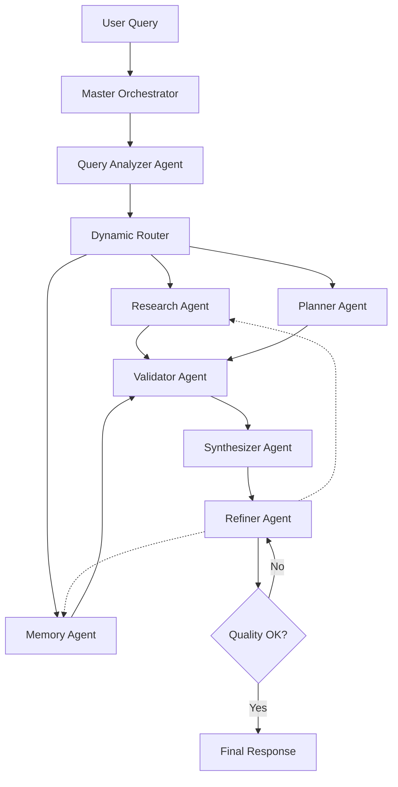

# 🚀 PLANO DE AÇÃO: IMPLEMENTAÇÃO DE AGENTIC-RAG REAL

## Data: 18/01/2025

## 🎯 OBJETIVO
Transformar o RAG tradicional atual em um **verdadeiro sistema Agentic-RAG** com múltiplos agentes especializados, orquestração inteligente e capacidade de auto-refinamento.

## 📋 FASES DE IMPLEMENTAÇÃO

### 🔷 FASE 1: ARQUITETURA DE AGENTES (2-3 dias)

#### 1.1 Criar Agentes Especializados
```typescript
// Estrutura base para cada agente
interface Agent {
  name: string;
  role: string;
  capabilities: string[];
  execute(input: AgentInput): Promise<AgentOutput>;
  confidence: number;
}
```

**Agentes a criar:**
- [ ] **QueryAnalyzerAgent**: Analisa intent, decompõe queries complexas
- [ ] **ResearchAgent**: Busca informações (vector, SQL, full-text)
- [ ] **ValidatorAgent**: Valida informações, checa consistência
- [ ] **SynthesizerAgent**: Sintetiza respostas coerentes
- [ ] **RefinerAgent**: Melhora e refina respostas
- [ ] **MemoryAgent**: Gerencia memória contextual
- [ ] **PlannerAgent**: Planeja estratégias de resolução

#### 1.2 Implementar Base Classes
```typescript
// supabase/functions/agents/base-agent.ts
abstract class BaseAgent {
  abstract execute(input: AgentInput): Promise<AgentOutput>;
  abstract validateInput(input: any): boolean;
  abstract calculateConfidence(result: any): number;
}
```

### 🔷 FASE 2: ORQUESTRADOR MASTER (2 dias)

#### 2.1 Criar Orchestrator Central
```typescript
// supabase/functions/orchestrator/index.ts
class AgenticOrchestrator {
  agents: Map<string, Agent>;
  
  async processQuery(query: string): Promise<Response> {
    // 1. Analisar query
    // 2. Selecionar agentes necessários
    // 3. Executar em paralelo quando possível
    // 4. Coordenar resultados
    // 5. Auto-refinar se necessário
  }
}
```

#### 2.2 Implementar Decisão Dinâmica
- [ ] Router inteligente baseado em query type
- [ ] Execução paralela de agentes independentes
- [ ] Sistema de votação para consenso
- [ ] Fallback strategies

### 🔷 FASE 3: AUTO-REFINAMENTO (1-2 dias)

#### 3.1 Loop de Feedback
```typescript
class RefinerAgent {
  async refine(response: Response): Promise<Response> {
    while (confidence < threshold && iterations < maxIterations) {
      // 1. Avaliar resposta atual
      // 2. Identificar gaps
      // 3. Solicitar mais informações
      // 4. Melhorar resposta
      // 5. Re-avaliar confiança
    }
  }
}
```

#### 3.2 Métricas de Qualidade
- [ ] Confidence scoring system
- [ ] Completeness checker
- [ ] Consistency validator
- [ ] Relevance scorer

### 🔷 FASE 4: MEMÓRIA CONTEXTUAL (2 dias)

#### 4.1 Sistema de Memória Multi-Nível
```typescript
interface MemorySystem {
  shortTerm: SessionMemory;     // Contexto atual
  longTerm: PersistentMemory;   // Aprendizados
  episodic: InteractionHistory; // Histórico
  semantic: ConceptGraph;       // Relações
}
```

#### 4.2 Implementar Stores
- [ ] **Session Store**: Redis/Memory para contexto rápido
- [ ] **Knowledge Graph**: Neo4j ou PostgreSQL com relações
- [ ] **Learning Store**: Padrões e insights aprendidos
- [ ] **Context Window**: Sliding window de interações

### 🔷 FASE 5: RACIOCÍNIO MULTI-ETAPAS (2 dias)

#### 5.1 Chain-of-Thought
```typescript
class ReasoningAgent {
  async reason(query: ComplexQuery): Promise<ThoughtChain> {
    // 1. Decompor problema
    // 2. Identificar sub-tarefas
    // 3. Resolver incrementalmente
    // 4. Validar cada etapa
    // 5. Sintetizar solução final
  }
}
```

#### 5.2 Planning & Execution
- [ ] Task decomposition
- [ ] Dependency resolution
- [ ] Step-by-step execution
- [ ] Progress tracking

### 🔷 FASE 6: INTEGRAÇÃO E TESTES (2 dias)

#### 6.1 Integração Completa
- [ ] Conectar todos os agentes
- [ ] Configurar orquestrador
- [ ] Setup memória persistente
- [ ] Configurar métricas e logs

#### 6.2 Testing Suite
- [ ] Unit tests por agente
- [ ] Integration tests
- [ ] Performance benchmarks
- [ ] Stress tests

## 📊 ARQUITETURA PROPOSTA



## 🛠️ IMPLEMENTAÇÃO TÉCNICA

### Edge Functions Necessárias:
```bash
supabase/functions/
├── orchestrator-master/        # Orquestrador principal
├── agents/
│   ├── query-analyzer/        # Análise de queries
│   ├── research-agent/        # Pesquisa multi-fonte
│   ├── validator-agent/       # Validação
│   ├── synthesizer-agent/     # Síntese
│   ├── refiner-agent/         # Refinamento
│   ├── memory-agent/          # Memória
│   └── planner-agent/         # Planejamento
├── memory/
│   ├── session-store/         # Memória de sessão
│   └── knowledge-graph/       # Grafo de conhecimento
└── utils/
    ├── confidence-scorer/     # Scoring de confiança
    └── thought-chain/         # Chain-of-thought
```

### Tabelas de Banco Necessárias:
```sql
-- Memória de agentes
CREATE TABLE agent_memory (
  id UUID PRIMARY KEY,
  agent_name TEXT,
  memory_type TEXT, -- short_term, long_term, episodic
  content JSONB,
  embedding VECTOR(1536),
  created_at TIMESTAMPTZ,
  expires_at TIMESTAMPTZ
);

-- Grafo de conhecimento
CREATE TABLE knowledge_graph (
  id UUID PRIMARY KEY,
  source_concept TEXT,
  target_concept TEXT,
  relationship TEXT,
  confidence FLOAT,
  metadata JSONB
);

-- Histórico de raciocínio
CREATE TABLE reasoning_traces (
  id UUID PRIMARY KEY,
  query_id UUID,
  agent_name TEXT,
  thought_chain JSONB,
  decisions JSONB,
  confidence FLOAT,
  execution_time INT
);
```

## 📈 MÉTRICAS DE SUCESSO

### KPIs Principais:
- **Acurácia**: >98% em queries do domínio
- **Queries Complexas**: >95% resolução bem-sucedida
- **Auto-Refinamento**: >80% das respostas melhoradas
- **Tempo Médio**: <3s para queries simples, <8s complexas
- **Paralelização**: >60% dos agentes executando em paralelo
- **Memória Útil**: >70% de hit rate em contexto relevante

### Benchmarks:
```typescript
// Teste de capacidades
const benchmarks = {
  multiStep: "Qual a altura máxima em Petrópolis e como isso se compara com o Centro?",
  reasoning: "Por que algumas áreas têm restrições de altura?",
  complex: "Analise todas as restrições para construir um prédio de 20 andares na Cidade Baixa",
  contextual: "Considerando nossa conversa anterior sobre altura, e as zonas?",
  learning: "O que você aprendeu sobre minhas preferências?"
};
```

## 🚦 CRONOGRAMA

| Fase | Duração | Status | Prioridade |
|------|---------|--------|------------|
| Fase 1: Agentes | 2-3 dias | 🔴 Não iniciado | Alta |
| Fase 2: Orquestrador | 2 dias | 🔴 Não iniciado | Alta |
| Fase 3: Auto-Refinamento | 1-2 dias | 🔴 Não iniciado | Alta |
| Fase 4: Memória | 2 dias | 🔴 Não iniciado | Média |
| Fase 5: Raciocínio | 2 dias | 🔴 Não iniciado | Média |
| Fase 6: Integração | 2 dias | 🔴 Não iniciado | Alta |

**Total estimado**: 11-14 dias

## 🎯 QUICK WINS (Implementar Primeiro)

### Dia 1-2: MVP Mínimo
1. **Criar 3 agentes básicos**: Analyzer, Research, Synthesizer
2. **Orquestrador simples**: Sequencial primeiro, paralelo depois
3. **Auto-refinamento básico**: Loop simples com threshold

### Benefícios Imediatos:
- Arquitetura modular desde o início
- Capacidade de adicionar agentes incrementalmente
- Sistema funcional em 2 dias
- Base para evolução contínua

## 🔄 MIGRAÇÃO GRADUAL

### Estratégia:
1. **Manter sistema atual funcionando**
2. **Implementar novo em paralelo** (`agentic-rag-v4`)
3. **Feature flag** para alternar sistemas
4. **Migração gradual** por tipo de query
5. **Rollback fácil** se necessário

```typescript
// Frontend switch
const useNewAgenticSystem = localStorage.getItem('useAgenticV4') === 'true';
const endpoint = useNewAgenticSystem ? 'agentic-rag-v4' : 'agentic-rag';
```

## ✅ PRÓXIMOS PASSOS IMEDIATOS

1. [ ] Criar estrutura base de agentes
2. [ ] Implementar QueryAnalyzerAgent
3. [ ] Implementar ResearchAgent  
4. [ ] Criar Orchestrator básico
5. [ ] Testar fluxo end-to-end simples
6. [ ] Adicionar auto-refinamento
7. [ ] Implementar memória de sessão
8. [ ] Expandir para mais agentes

## 📝 NOTAS IMPORTANTES

### Vantagens do Agentic-RAG Real:
- ✅ **Modularidade**: Cada agente é independente
- ✅ **Escalabilidade**: Adicionar agentes sem quebrar sistema
- ✅ **Manutenibilidade**: Código organizado por responsabilidade
- ✅ **Performance**: Paralelização natural
- ✅ **Inteligência**: Decisões dinâmicas baseadas em contexto
- ✅ **Aprendizado**: Sistema melhora com o tempo
- ✅ **Robustez**: Fallbacks e redundância

### Riscos e Mitigações:
- ⚠️ **Complexidade**: Mitigar com boa documentação e testes
- ⚠️ **Latência**: Mitigar com paralelização e cache
- ⚠️ **Custos**: Mitigar com cache inteligente e rate limiting
- ⚠️ **Debugging**: Mitigar com trace detalhado e logs

## 🎉 RESULTADO ESPERADO

Um sistema verdadeiramente inteligente que:
- **Entende** queries complexas profundamente
- **Raciocina** através de múltiplas etapas
- **Aprende** com cada interação
- **Melhora** suas próprias respostas
- **Colabora** entre agentes especializados
- **Adapta** estratégias dinamicamente
- **Mantém** contexto e memória
- **Escala** facilmente com novos agentes

---

**Pronto para começar a implementação do Agentic-RAG real!** 🚀