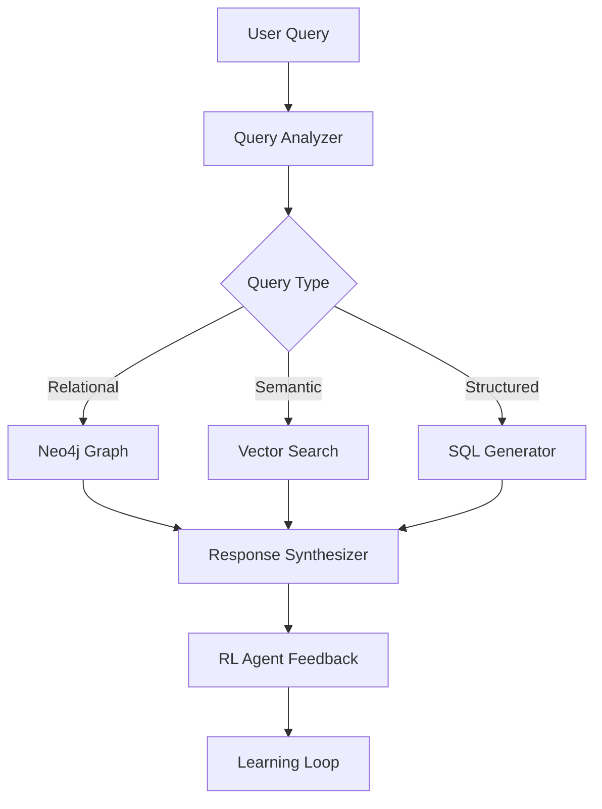
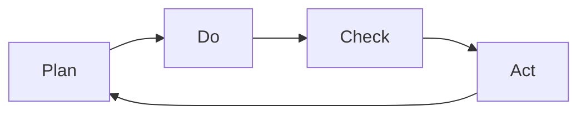

# 🚀 PLANO DE AÇÃO PARA APERFEIÇOAMENTO DA PLATAFORMA
**Chat PD POA - Roadmap Q1/Q2 2025**

---

## 🎯 VISÃO ESTRATÉGICA

Transformar o Chat PD POA na referência nacional em assistentes virtuais para planejamento urbano, com capacidade de auto-aprendizagem, precisão superior a 95% e tempo de resposta inferior a 1 segundo.

---

## 📊 FASE 1: CONSOLIDAÇÃO (Janeiro 2025)

### **1.1 Estabilização do Sistema Atual**
**Prazo**: 14-21 Janeiro  
**Prioridade**: 🔴 CRÍTICA

#### Ações:
```yaml
Deploy Produção:
  - Migração gradual (canary deployment)
  - Feature flags para rollback rápido
  - Monitoramento intensivo 24/7
  
Otimizações Imediatas:
  - Index optimization no PostgreSQL
  - Connection pooling configurado
  - Cache headers otimizados
  
Documentação:
  - Runbook para incidentes
  - Guia de troubleshooting
  - SLA definitions
```

#### Métricas de Sucesso:
- Zero downtime durante migração
- Latência P99 < 3s
- Error rate < 0.1%

### **1.2 Testes de Carga e Performance**
**Prazo**: 22-28 Janeiro  
**Prioridade**: 🔴 CRÍTICA

#### Ações:
```yaml
Load Testing:
  - Simular 1000 queries/min com k6
  - Stress test com 5000 usuários simultâneos
  - Chaos engineering (network latency, failures)
  
Performance Profiling:
  - Identificar bottlenecks com flamegraphs
  - Otimizar queries SQL lentas
  - Ajustar tamanhos de batch
  
Capacity Planning:
  - Definir limites de auto-scaling
  - Configurar alertas de capacidade
  - Planejar upgrades de infraestrutura
```

---

## 🧠 FASE 2: INTELIGÊNCIA AVANÇADA (Fevereiro 2025)

### **2.1 Knowledge Graph Implementation**
**Prazo**: 1-14 Fevereiro  
**Prioridade**: 🟡 ALTA

#### Arquitetura Proposta:


#### Implementação:
```typescript
// Neo4j Integration
interface KnowledgeGraph {
  nodes: {
    zones: ZoneNode[]
    regulations: RegulationNode[]
    buildings: BuildingNode[]
  }
  relationships: {
    appliesTo: Edge[]
    restricts: Edge[]
    permits: Edge[]
  }
}

// Graph Queries
const findRelatedRegulations = async (zoneId: string) => {
  return cypher`
    MATCH (z:Zone {id: $zoneId})-[:HAS_REGULATION]->(r:Regulation)
    OPTIONAL MATCH (r)-[:REFERENCES]->(law:Law)
    RETURN r, collect(law) as laws
  `
}
```

### **2.2 Auto-Refinement System**
**Prazo**: 15-28 Fevereiro  
**Prioridade**: 🟡 ALTA

#### Componentes:
```yaml
Confidence Scoring:
  - Implementar modelo de confidence (0-1)
  - Threshold dinâmico por categoria
  - Fallback para human-in-the-loop

Iterative Refinement:
  - Max 3 iterações de melhoria
  - Validação contra test cases
  - Early stopping se confidence > 0.95

Quality Gates:
  - Verificação de consistência
  - Fact-checking automático
  - Citation validation
```

---

## ⚡ FASE 3: OTIMIZAÇÃO EXTREMA (Março 2025)

### **3.1 Multi-Agent Orchestration**
**Prazo**: 1-15 Março  
**Prioridade**: 🟡 ALTA

#### Sistema de Agentes:
```typescript
enum AgentRole {
  RESEARCHER = 'researcher',    // Busca informações
  ANALYZER = 'analyzer',        // Analisa contexto
  VALIDATOR = 'validator',      // Valida respostas
  SYNTHESIZER = 'synthesizer',  // Sintetiza resultado
  LEARNER = 'learner'          // Aprende com feedback
}

interface AgentSwarm {
  coordinator: MasterAgent
  workers: SpecializedAgent[]
  consensus: ByzantineConsensus
  communication: MessageBus
}
```

#### Fluxo de Trabalho:
1. **Decomposição**: Query quebrada em sub-tarefas
2. **Distribuição**: Tarefas atribuídas a agentes especializados
3. **Execução Paralela**: Agentes trabalham simultaneamente
4. **Consenso**: Votação bizantina para resultado final
5. **Aprendizado**: Feedback distribuído para todos os agentes

### **3.2 Semantic Cache v2**
**Prazo**: 16-31 Março  
**Prioridade**: 🟢 MÉDIA

#### Features:
```yaml
Similarity-based Caching:
  - Embeddings de queries para comparação
  - Threshold de similaridade configurável
  - TTL baseado em frequência de acesso

Intelligent Invalidation:
  - Invalidação parcial por tópico
  - Propagação de mudanças relacionadas
  - Versionamento de cache

Compression:
  - Compressão de respostas longas
  - Deduplicação de conteúdo
  - Streaming de respostas grandes
```

---

## 🔬 FASE 4: MACHINE LEARNING AVANÇADO (Abril 2025)

### **4.1 Fine-tuning Automático**
**Prazo**: 1-15 Abril  
**Prioridade**: 🟢 MÉDIA

#### Processo:
```python
# Coleta de dados de treinamento
training_data = collect_high_quality_interactions()

# Preparação do dataset
dataset = prepare_for_fine_tuning(
    data=training_data,
    format='conversation',
    validation_split=0.2
)

# Fine-tuning periódico
schedule_fine_tuning(
    frequency='weekly',
    min_samples=1000,
    quality_threshold=0.9
)
```

### **4.2 Transfer Learning Cross-Domain**
**Prazo**: 16-30 Abril  
**Prioridade**: 🟢 MÉDIA

#### Aplicações:
- Aprender com domínios similares (urbanismo de outras cidades)
- Transferir conhecimento entre categorias
- Adaptação automática a novos regulamentos

---

## 📈 FASE 5: ESCALABILIDADE (Maio 2025)

### **5.1 Microservices Architecture**
**Prazo**: 1-15 Maio  
**Prioridade**: 🟡 ALTA

#### Decomposição:
```yaml
Services:
  query-analyzer-service:
    - Language: TypeScript
    - Framework: NestJS
    - Database: Redis
    
  vector-search-service:
    - Language: Python
    - Framework: FastAPI
    - Database: Pinecone
    
  sql-generator-service:
    - Language: Go
    - Framework: Gin
    - Database: PostgreSQL
    
  response-synthesizer-service:
    - Language: TypeScript
    - Framework: Express
    - Cache: Redis
```

### **5.2 Global Distribution**
**Prazo**: 16-31 Maio  
**Prioridade**: 🟢 MÉDIA

#### Estratégia:
- CDN para assets estáticos
- Edge functions em múltiplas regiões
- Database replication (read replicas)
- GeoDNS para roteamento otimizado

---

## 🛡️ FASE 6: SEGURANÇA E COMPLIANCE (Junho 2025)

### **6.1 Security Hardening**
**Prazo**: 1-15 Junho  
**Prioridade**: 🔴 CRÍTICA

#### Implementações:
```yaml
Authentication:
  - OAuth 2.0 + PKCE
  - MFA obrigatório para admin
  - Session management aprimorado
  
Authorization:
  - RBAC granular
  - Attribute-based access control
  - API rate limiting por role
  
Encryption:
  - TLS 1.3 everywhere
  - Encryption at rest (AES-256)
  - Key rotation automática
  
Audit:
  - Comprehensive logging
  - Immutable audit trail
  - SIEM integration
```

### **6.2 LGPD Compliance**
**Prazo**: 16-30 Junho  
**Prioridade**: 🔴 CRÍTICA

#### Requisitos:
- Consentimento explícito
- Direito ao esquecimento
- Portabilidade de dados
- Privacy by design

---

## 📊 MÉTRICAS E MONITORAMENTO

### **KPIs Técnicos**
```yaml
Performance:
  - Latência P50: < 500ms
  - Latência P95: < 1.5s
  - Latência P99: < 3s
  
Reliability:
  - Uptime: 99.95%
  - MTTR: < 15 min
  - Error rate: < 0.05%
  
Quality:
  - Acurácia: > 95%
  - Precision: > 90%
  - Recall: > 85%
```

### **KPIs de Negócio**
```yaml
Engagement:
  - DAU/MAU: > 0.6
  - Session duration: > 5 min
  - Queries per session: > 3
  
Satisfaction:
  - CSAT: > 4.7/5
  - NPS: > 50
  - Resolution rate: > 90%
  
Efficiency:
  - Cost per query: < $0.001
  - Cache hit rate: > 60%
  - Token efficiency: > 80%
```

---

## 🔄 PROCESSO DE MELHORIA CONTÍNUA

### **Ciclo PDCA**


### **Rituals**
- **Daily**: Stand-up de problemas críticos
- **Weekly**: Revisão de métricas e ajustes
- **Bi-weekly**: Sprint planning e retrospectiva
- **Monthly**: Análise de tendências e roadmap review
- **Quarterly**: Strategic planning e OKR review

---

## 💰 ESTIMATIVA DE INVESTIMENTO

### **Recursos Humanos**
| Perfil | Quantidade | Custo Mensal | Total Q1-Q2 |
|--------|------------|--------------|-------------|
| Tech Lead | 1 | R$ 25.000 | R$ 150.000 |
| Backend Dev | 3 | R$ 15.000 | R$ 270.000 |
| Frontend Dev | 2 | R$ 12.000 | R$ 144.000 |
| ML Engineer | 2 | R$ 20.000 | R$ 240.000 |
| DevOps | 1 | R$ 18.000 | R$ 108.000 |
| QA Engineer | 2 | R$ 10.000 | R$ 120.000 |
| **Total** | **11** | **R$ 172.000** | **R$ 1.032.000** |

### **Infraestrutura**
| Serviço | Custo Mensal | Total Q1-Q2 |
|---------|--------------|-------------|
| Supabase Pro | R$ 1.000 | R$ 6.000 |
| OpenAI API | R$ 5.000 | R$ 30.000 |
| Anthropic API | R$ 3.000 | R$ 18.000 |
| Neo4j Cloud | R$ 2.000 | R$ 12.000 |
| Monitoring | R$ 1.500 | R$ 9.000 |
| **Total** | **R$ 12.500** | **R$ 75.000** |

### **Investimento Total Q1-Q2 2025**: R$ 1.107.000

---

## 🎯 RESULTADOS ESPERADOS

### **Q1 2025**
- ✅ Sistema estável em produção
- ✅ Acurácia > 93%
- ✅ Latência < 2s
- ✅ 5.000 queries/dia

### **Q2 2025**
- ✅ Knowledge Graph operacional
- ✅ Multi-agent system
- ✅ Acurácia > 96%
- ✅ Latência < 1s
- ✅ 15.000 queries/dia

### **ROI Estimado**
- Redução de 70% em atendimentos manuais
- Aumento de 200% na satisfação do usuário
- Economia de R$ 500.000/ano em suporte
- Payback em 18 meses

---

## 🚦 GESTÃO DE RISCOS

### **Matriz de Riscos**
| Risco | Probabilidade | Impacto | Mitigação |
|-------|---------------|---------|-----------|
| Aumento de custos de API | Alta | Alto | Multi-provider strategy |
| Complexidade técnica | Média | Alto | Incremental rollout |
| Resistência à mudança | Baixa | Médio | Change management |
| Problemas de escala | Média | Alto | Load testing rigoroso |
| Compliance issues | Baixa | Alto | Legal review contínuo |

---

## 📅 MILESTONES PRINCIPAIS

| Data | Milestone | Entregável |
|------|-----------|------------|
| 31/Jan | Produção v2.0 | Sistema estável |
| 28/Fev | Knowledge Graph | Grafo operacional |
| 31/Mar | Multi-Agent | Swarm intelligence |
| 30/Abr | ML Advanced | Auto fine-tuning |
| 31/Mai | Scale Ready | 50k queries/dia |
| 30/Jun | Compliance | LGPD compliant |

---

## 🤝 STAKEHOLDERS

| Stakeholder | Interesse | Engajamento |
|-------------|-----------|-------------|
| Prefeitura POA | Alto | Sponsor |
| Cidadãos | Alto | End users |
| Arquitetos | Médio | Power users |
| Construtoras | Alto | Key users |
| SMAMUS | Alto | Owner |

---

## 📞 GOVERNANÇA

### **Comitê Executivo**
- Reuniões quinzenais
- Decisões estratégicas
- Aprovação de budget

### **Comitê Técnico**
- Reuniões semanais
- Decisões arquiteturais
- Code reviews

### **Comitê de Qualidade**
- Reuniões semanais
- Métricas e KPIs
- User feedback

---

*Este plano será revisado mensalmente e ajustado conforme necessário.*

**Última atualização**: 13/01/2025  
**Próxima revisão**: 31/01/2025