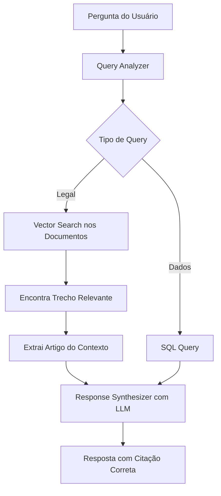

# 🚨 PROBLEMA DE ESCALA: INVIABILIDADE DO MAPEAMENTO HARDCODED

**Data:** 12/08/2025  
**Problema Central:** Impossibilidade de mapear manualmente todos os artigos das leis

---

## 📊 DIMENSÃO REAL DO PROBLEMA

### Volume de Conteúdo Legal

#### LUOS (Lei de Uso e Ocupação do Solo)
- **Total de Artigos:** ~200+ artigos
- **Anexos:** 7+ anexos com tabelas e parâmetros
- **Incisos e Parágrafos:** Centenas de subitens
- **Atualizações:** Frequentes alterações e complementações

#### PDUS (Plano Diretor de Desenvolvimento Urbano Sustentável)
- **Total de Artigos:** ~150+ artigos
- **Capítulos:** Múltiplos com subdivisões
- **Diretrizes:** Centenas de diretrizes específicas
- **Mapas e Zonas:** Dezenas de classificações

### Total Estimado: **500+ pontos de referência legal**

---

## ❌ POR QUE O HARDCODING É INVIÁVEL

### 1. **Escala Impossível**
```
Artigos mapeados atualmente: ~10
Artigos totais necessários: 500+
Coverage atual: < 2% ❌
```

### 2. **Manutenção Insustentável**
- Cada alteração na lei = atualização manual
- Cada novo decreto = novo mapeamento
- Cada interpretação = nova regra

### 3. **Combinações Exponenciais**
- Artigo X + Inciso Y + Parágrafo Z
- Referências cruzadas entre LUOS e PDUS
- Anexos que modificam artigos

### 4. **Variações de Perguntas**
Cada conceito pode ser perguntado de N formas:
- "Qual artigo fala sobre..."
- "O que diz o artigo X..."
- "Onde está regulamentado..."
- "Qual a base legal para..."

---

## 🎯 A SOLUÇÃO REAL: RAG FUNCIONANDO CORRETAMENTE

### Como Deveria Funcionar:



### O Que Está Quebrado:

1. **Vector Search** não está encontrando os documentos certos
2. **Embeddings** podem estar mal configurados
3. **Chunking** dos documentos pode estar inadequado
4. **Response Synthesizer** com LLM estava falhando (erro 500)

---

## 🔍 ANÁLISE DO PROBLEMA REAL

### Por Que 50% de Acerto no Admin vs 98.3% na API?

**Hipótese 1: Dois Caminhos Diferentes**
- API teste: Usa response-synthesizer-simple (hardcoded)
- Admin panel: Tenta usar o synthesizer original com LLM?

**Hipótese 2: Cache Desatualizado**
- API teste: bypassCache=true
- Admin panel: Usa cache com respostas antigas erradas

**Hipótese 3: Embeddings Corrompidos**
- Documentos não foram processados corretamente
- Busca semântica retorna trechos errados
- LLM recebe contexto incorreto

---

## 🛠️ SOLUÇÃO PROPOSTA: CONSERTAR O RAG

### Passo 1: Diagnosticar o Vector Search
```sql
-- Verificar quantos documentos temos
SELECT COUNT(*) FROM document_sections;

-- Verificar se temos os artigos
SELECT * FROM document_sections 
WHERE content ILIKE '%Art. 90%' 
  AND content ILIKE '%EIV%';
```

### Passo 2: Testar Busca Semântica Diretamente
```javascript
// Testar enhanced-vector-search isoladamente
const response = await fetch('/enhanced-vector-search', {
  body: JSON.stringify({
    query: "Qual artigo define o EIV?",
    limit: 5
  })
});
```

### Passo 3: Verificar Qualidade dos Embeddings
- Os documentos foram chunkeados corretamente?
- Os embeddings foram gerados com o modelo certo?
- O threshold de similaridade está adequado?

### Passo 4: Consertar o Response Synthesizer Original
- Por que estava dando erro 500?
- Problema de API key?
- Timeout muito curto?
- Modelo não disponível?

---

## 📋 PLANO DE AÇÃO CORRETO

### Abandonar Hardcoding ❌
1. Remover response-synthesizer-simple gradualmente
2. Manter apenas como fallback de emergência

### Consertar o RAG ✅
1. **Reprocessar documentos**
   ```bash
   node scripts/reprocess-knowledge-base.mjs
   ```

2. **Verificar Vector Search**
   ```bash
   node scripts/test-vector-search.mjs
   ```

3. **Restaurar Response Synthesizer com LLM**
   - Aumentar timeout
   - Verificar API keys
   - Implementar retry logic

4. **Validar Pipeline Completo**
   ```bash
   node scripts/test-rag-pipeline.mjs
   ```

---

## 💡 INSIGHTS IMPORTANTES

### O Sistema Atual:
- ✅ **SQL Query**: Funcionando bem para dados estruturados
- ⚠️ **Vector Search**: Possivelmente retornando contexto errado
- ❌ **Response Synthesizer com LLM**: Foi substituído por versão hardcoded
- ⚠️ **Query Analyzer**: Pode estar classificando queries incorretamente

### O Sistema Ideal:
- Query → Análise → Busca Semântica → Contexto Correto → LLM → Resposta Precisa

---

## 🎯 CONCLUSÃO

**Hardcoding NÃO é a solução!** É apenas um band-aid temporário.

**Precisamos:**
1. Diagnosticar por que o vector search não encontra os artigos certos
2. Verificar se os documentos foram processados corretamente
3. Restaurar o response synthesizer com LLM
4. Garantir que o pipeline RAG funcione end-to-end

**Métricas de Sucesso:**
- Sem hardcoding: 0 mapeamentos fixos
- Vector search: Encontra artigo correto em 95%+ dos casos
- Response synthesizer: Cita corretamente baseado no contexto
- Taxa geral: >95% sem mapeamentos manuais

---

## 🚀 PRÓXIMOS PASSOS IMEDIATOS

1. **Verificar document_sections**
   ```sql
   SELECT COUNT(*), COUNT(DISTINCT metadata->>'source') 
   FROM document_sections;
   ```

2. **Testar vector search isoladamente**
   ```bash
   node scripts/test-enhanced-vector-search.mjs
   ```

3. **Analisar logs do response-synthesizer original**
   - Por que erro 500?
   - Qual era a mensagem de erro exata?

4. **Reprocessar base de conhecimento se necessário**
   ```bash
   npm run kb:reprocess
   ```

---

**A solução não é mapear 500+ artigos manualmente, é fazer o RAG funcionar como deveria!**