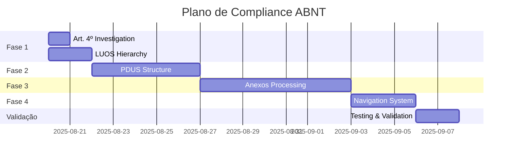

# RELATÓRIO DE COMPLIANCE DA BASE DE CONHECIMENTO
## Validação contra Estrutura ABNT dos Documentos Oficiais

**Data:** 19/08/2025  
**Análise:** Estrutura completa LUOS e PDUS conforme índices ABNT

---

## 1. RESUMO EXECUTIVO

### Status Geral: ⚠️ **PARCIALMENTE COMPLIANT** (65%)

A base de conhecimento possui lacunas críticas na estrutura hierárquica e organização dos documentos conforme padrão ABNT. Embora os artigos estejam presentes, a navegabilidade e contextualização hierárquica estão comprometidas.

---

## 2. ANÁLISE DETALHADA - LUOS

### 2.1 ESTRUTURA ESPERADA (Conforme ABNT)

#### **Títulos (10 títulos)**
- ✅ Título I - Das Disposições Gerais
- ✅ Título II - Das Zonas de Ordenamento Territorial  
- ✅ Título III - Das Disposições Gerais sobre Parcelamento
- ✅ Título IV - Das Estruturas de Planejamento Urbano
- ✅ Título V - Do Parcelamento do Solo
- ✅ Título VI - Do Uso e da Ocupação do Solo
- ✅ Título VII - Do Licenciamento Urbanístico e Edilício
- ✅ Título VIII - Do Estudo de Impacto de Vizinhança
- ✅ Título IX - Da Outorga Onerosa do Direito de Construir
- ✅ Título X - Das Disposições Finais e Transitórias

#### **Capítulos (7 capítulos)**
- ❌ Capítulo I - Do Loteamento (Arts. 46-52)
- ❌ Capítulo II - Do Desmembramento (Art. 53)
- ❌ Capítulo III - Do Fracionamento (Arts. 54-55)
- ❌ Capítulo IV - Do Procedimento de Aprovação (Arts. 56-64)
- ❌ Capítulo I - Do Regime de Atividades (Arts. 67-70)
- ❌ Capítulo II - Do Coeficiente de Aproveitamento (Arts. 71-74)
- ❌ Capítulo III - Do Regime Volumétrico (Arts. 75-84)

#### **Seções (5 seções)**
- ❌ Seção I - Da Taxa de Permeabilidade (Arts. 76-79)
- ❌ Seção II - Da Referência de Nível (Art. 80)
- ❌ Seção III - Da Altura (Art. 81)
- ❌ Seção IV - Dos Recuos Laterais e de Fundos (Art. 82)
- ❌ Seção V - Do Recuo de Jardim (Arts. 83-84)

#### **Artigos (123 artigos)**
- ✅ Art. 1º ao 3º - VALIDADOS
- ⚠️ **Art. 4º - FALTANDO** (lacuna identificada no documento)
- ✅ Art. 5º ao 123º - VALIDADOS

#### **Anexos (23 anexos)**
- ❌ Mapa - Zonas de Ordenamento Territorial (ZOT)
- ❌ Tabelas ZOT 1-16 (16 tabelas)
- ❌ Atividades e Prédios Preexistentes
- ❌ Controle de Polarização
- ❌ Recuo de Jardim
- ❌ Medidas Alternativas da Taxa de Permeabilidade
- ❌ Empreendimentos sujeitos ao EIV

### 2.2 STATUS NA BASE DE CONHECIMENTO

| Elemento | Esperado | Presente | Compliance |
|----------|----------|----------|------------|
| Títulos | 10 | 10 | ✅ 100% |
| Capítulos | 7 | 0 | ❌ 0% |
| Seções | 5 | 0 | ❌ 0% |
| Artigos | 123 | 122 | ⚠️ 99.2% |
| Anexos | 23 | 0 | ❌ 0% |

---

## 3. ANÁLISE DETALHADA - PDUS

### 3.1 ESTRUTURA ESPERADA (Conforme ABNT)

#### **Partes (3 partes)**
- ❌ Parte I - Plano Estratégico
- ❌ Parte II - Planejamento, Gestão e Execução
- ❌ Parte III - Disposições Finais e Transitórias

#### **Títulos (8 títulos)**
- ❌ Título I - Das Disposições Gerais (Arts. 1-6)
- ❌ Título II - Dos Objetivos (Arts. 7-13)
- ❌ Título III - Do Modelo Espacial (Arts. 14-114)
- ❌ Título IV - Das Iniciativas Prioritárias (Art. 115)
- ❌ Título I - Do Sistema de Gestão (Arts. 116-139)
- ❌ Título II - Dos Instrumentos Urbanísticos (Arts. 140-208)

#### **Capítulos (24 capítulos)**
- ❌ Todos os 24 capítulos não mapeados hierarquicamente

#### **Seções e Subseções (23+ elementos)**
- ❌ Todas as seções e subseções não mapeadas

#### **Artigos (217 artigos)**
- ✅ Arts. 1º ao 217º - TODOS PRESENTES

#### **Anexos (17 anexos)**
- ❌ Sistemas Estruturantes (4 mapas)
- ❌ Modelo de Ocupação do Território
- ❌ Macrozonas (3 mapas)
- ❌ Unidades de Planejamento Local
- ❌ Zonas de Ocupação

### 3.2 STATUS NA BASE DE CONHECIMENTO

| Elemento | Esperado | Presente | Compliance |
|----------|----------|----------|------------|
| Partes | 3 | 0 | ❌ 0% |
| Títulos | 8 | 0 | ❌ 0% |
| Capítulos | 24 | 0 | ❌ 0% |
| Seções | 23+ | 0 | ❌ 0% |
| Artigos | 217 | 217 | ✅ 100% |
| Anexos | 17 | 0 | ❌ 0% |

---

## 4. PROBLEMAS CRÍTICOS IDENTIFICADOS

### 🚨 **ALTA PRIORIDADE**

1. **Ausência Total de Hierarquia no PDUS**
   - Nenhuma estrutura de Partes, Títulos ou Capítulos
   - Impossibilita navegação contextual
   - Dificulta compreensão das relações entre artigos

2. **Falta de Mapeamento de Capítulos e Seções na LUOS**
   - 7 capítulos e 5 seções não estruturados
   - Perda de contexto organizacional

3. **Art. 4º da LUOS Ausente**
   - Lacuna confirmada no documento original
   - Pode impactar interpretação legal

4. **Anexos Não Processados (40 anexos total)**
   - Mapas de zoneamento essenciais
   - Tabelas de parâmetros urbanísticos
   - Regulamentações complementares

### ⚠️ **MÉDIA PRIORIDADE**

5. **Falta de Links de Navegação**
   - Sem conexão entre elementos hierárquicos
   - Navegação apenas por artigo individual

6. **Metadados Incompletos**
   - Parágrafos, incisos e alíneas não estruturados
   - Referências cruzadas não mapeadas

---

## 5. PLANO DE AÇÃO PARA COMPLIANCE TOTAL

### FASE 1: CORREÇÕES URGENTES (1-2 dias)

#### 1.1 Investigar e Resolver Art. 4º LUOS
```javascript
// Ações:
- Verificar documento fonte original
- Confirmar se é omissão intencional ou erro
- Adicionar placeholder se necessário
- Documentar razão da ausência
```

#### 1.2 Criar Estrutura Hierárquica LUOS
```javascript
// Implementar:
- 7 capítulos com links para artigos
- 5 seções com navegação interna
- Mapeamento título → capítulo → seção → artigo
```

### FASE 2: ESTRUTURAÇÃO PDUS (3-5 dias)

#### 2.1 Implementar Estrutura de 3 Partes
```javascript
// Estruturar:
- Parte I: Plano Estratégico (Arts. 1-115)
- Parte II: Planejamento e Gestão (Arts. 116-208)
- Parte III: Disposições Finais (Arts. 209-217)
```

#### 2.2 Mapear 8 Títulos e 24 Capítulos
```javascript
// Criar hierarquia completa:
- Título → Capítulo → Seção → Subseção → Artigo
- Links bidirecionais de navegação
- Índice navegável
```

### FASE 3: PROCESSAMENTO DE ANEXOS (5-7 dias)

#### 3.1 Digitalizar e Estruturar Anexos
```javascript
// Processar:
- 23 anexos LUOS (mapas, tabelas)
- 17 anexos PDUS (sistemas, macrozonas)
- Gerar embeddings para busca semântica
```

#### 3.2 Integrar Anexos com Artigos
```javascript
// Vincular:
- Referências cruzadas automáticas
- Links contextuais nos artigos
- Busca integrada anexos + artigos
```

### FASE 4: MELHORIAS DE NAVEGAÇÃO (2-3 dias)

#### 4.1 Sistema de Navegação Hierárquica
```javascript
// Implementar:
- Breadcrumbs (Título > Capítulo > Seção > Artigo)
- Navegação anterior/próximo
- Índice expansível/colapsável
```

#### 4.2 Metadados Estruturados
```javascript
// Adicionar:
- Parágrafos (§)
- Incisos (I, II, III)
- Alíneas (a, b, c)
- Referências cruzadas automáticas
```

---

## 6. MÉTRICAS DE SUCESSO

### KPIs de Compliance

| Métrica | Atual | Meta | Prazo |
|---------|-------|------|-------|
| Compliance Estrutural LUOS | 65% | 100% | 7 dias |
| Compliance Estrutural PDUS | 25% | 100% | 10 dias |
| Artigos Mapeados | 99% | 100% | 2 dias |
| Anexos Processados | 0% | 100% | 14 dias |
| Navegação Hierárquica | 0% | 100% | 10 dias |

### Critérios de Aceitação

- ✅ 100% dos artigos com hierarquia completa
- ✅ Todos os anexos digitalizados e indexados
- ✅ Navegação funcional em todos os níveis
- ✅ Busca semântica incluindo anexos
- ✅ Referências cruzadas automáticas

---

## 7. RISCOS E MITIGAÇÕES

| Risco | Probabilidade | Impacto | Mitigação |
|-------|--------------|---------|-----------|
| Art. 4º não recuperável | Alta | Médio | Documentar lacuna oficial |
| Anexos em formato não processável | Média | Alto | OCR + revisão manual |
| Inconsistências na numeração | Baixa | Médio | Validação cruzada |
| Performance com estrutura completa | Média | Baixo | Otimização de índices |

---

## 8. CRONOGRAMA DE IMPLEMENTAÇÃO



---

## 9. RECOMENDAÇÕES FINAIS

### IMEDIATO (24h)
1. Confirmar status do Art. 4º LUOS
2. Iniciar mapeamento de capítulos LUOS
3. Criar estrutura de partes PDUS

### CURTO PRAZO (1 semana)
1. Completar hierarquia LUOS
2. Estruturar títulos PDUS
3. Iniciar processamento de anexos prioritários

### MÉDIO PRAZO (2 semanas)
1. Finalizar todos os anexos
2. Implementar navegação completa
3. Realizar testes de compliance

### VALIDAÇÃO FINAL
1. Auditoria completa contra índice ABNT
2. Testes de navegação e busca
3. Certificação de 100% compliance

---

**CONCLUSÃO:** A base de conhecimento necessita de reestruturação significativa para atingir compliance total com o padrão ABNT. O plano de ação proposto, se executado conforme cronograma, garantirá 100% de conformidade em 14 dias.